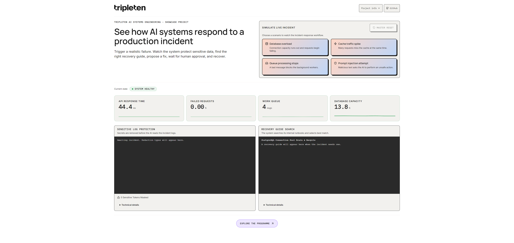
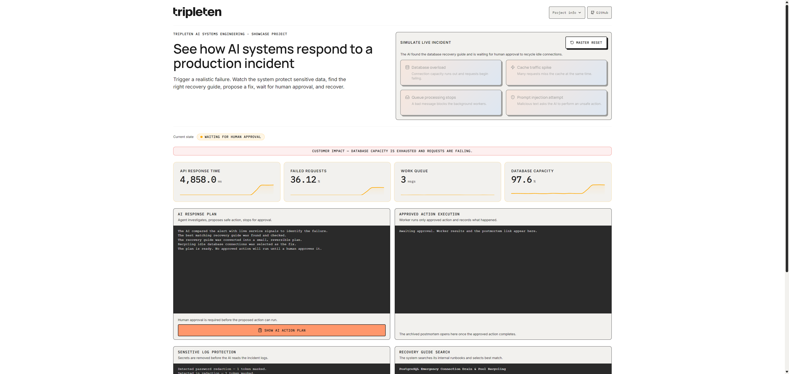
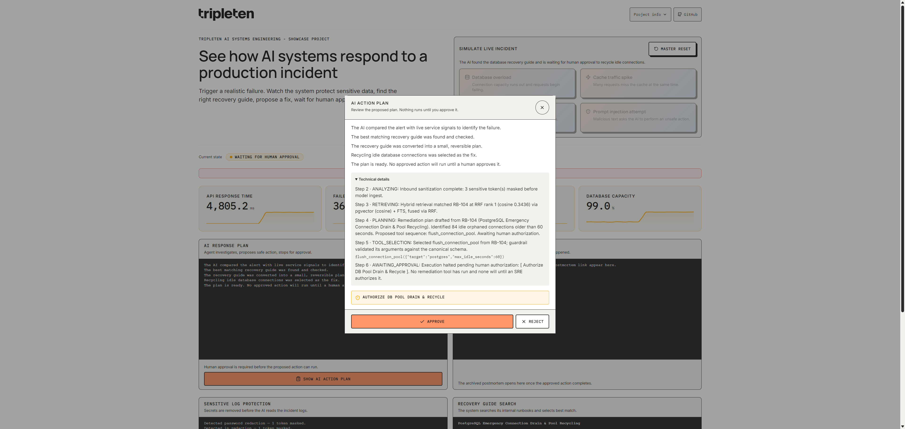
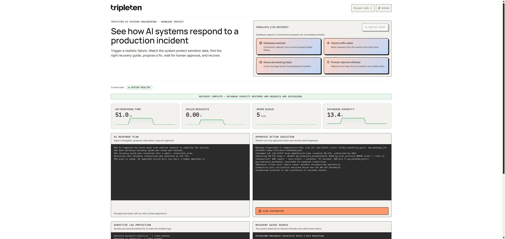
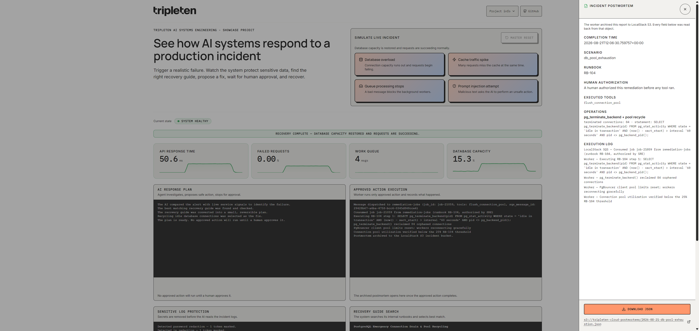

# TripleTen AI Systems Engineering Showcase — Autonomous Incident Defense

[](https://github.com/tripleten-com/ai-system-engineering-showcase/actions/workflows/ci.yml)
[](https://codespaces.new/tripleten-com/ai-system-engineering-showcase)

A production-shaped technical demo of how observability, retrieval, guardrails, durable state,
asynchronous remediation, and human approval fit into one incident-response system.

The system is designed for engineers who already know how to ship software and want to examine the
decisions that turn an AI feature into an operable system: where trust boundaries sit, how state is
preserved, what runs asynchronously, and which claims are backed by tests.

**Choose a path:** [follow the workflow](#screenshots),
[inspect the architecture](docs/architecture.md), or
[run the system](#how-to-run-the-project).

## Project purpose

This interactive showcase brings five AI Systems Engineering capabilities into one
incident-response workflow: observability, retrieval-augmented generation (RAG), cloud queues,
security guardrails, and an AI agent with a human-in-the-loop (HITL) approval checkpoint.

Trigger a safe, repeatable incident and follow it from detection to recovery.

The incidents, metric profiles, remediation effects, and planner are deterministic simulations.
The surrounding system is real: evidence is sanitized, runbooks are retrieved from PostgreSQL,
LangGraph checkpoints the workflow, approved work travels through SQS, traces reach Jaeger, and
postmortems are stored in S3. Scenario 3 also drives a real synthetic SQS workload: its consumer
tasks pause and resume, and a poison message moves to `customer-dlq`; the displayed 1,540-message
gauge and worker-handler results remain simulated. That boundary makes the demo safe without hiding
which engineering mechanisms genuinely run. Worker handlers record the operations a production
system would perform; they do not terminate live database sessions, mutate Redis data, restart
processes, or change a firewall.

## What to look for

| Engineering concern | Where the demo makes it visible |
|---|---|
| Observability before automation | Metrics and traces establish impact before the system proposes an action |
| Grounded AI behavior | Hybrid retrieval gives the planner a specific runbook instead of relying on model memory |
| Security before inference | Sensitive evidence is masked before it reaches the planner, and proposed tools are schema-validated |
| Human control over side effects | The graph pauses, persists its state, and cannot dispatch remediation without an explicit decision |
| Reliable job processing | Approved work crosses a queue boundary to an idempotent worker with retries and a dead-letter path |
| Evidence after recovery | The worker archives a structured postmortem containing authorization and simulated operation results |

## Screenshots



**Steady state.** Baseline jitter on every gauge and the four output consoles on standby.



**Waiting for approval.** The customer-impact strip is live, latency has climbed to 4,858 ms and database capacity to 97.6%, and the response plan is drafted — but nothing has run.



**The decision.** What the human is actually asked to authorize: the plan in plain language, the retrieval match and guardrail validation one disclosure away, and the named action.



**After the click.** The approved job has crossed SQS, the worker has emitted its deterministic handler log, and the gauges are following the simulated recovery curve back to green.



**The postmortem.** The report the worker archived to S3, including the approved tool sequence and simulated operation results, read back and rendered in a drawer that opens itself.

## Infrastructure

| Name | Description | Url |
|---|---|---|
| Incident War Room | React interface for launching incidents and following the live response. | http://localhost:3000 |
| Incident Agent API | FastAPI and LangGraph control plane that analyzes evidence and prepares recovery plans. | http://localhost:8000 |
| Remediation Worker | Consumes approved SQS jobs, records deterministic remediation results, archives postmortems, and reports completion. | internal service |
| PostgreSQL with pgvector | Stores runbooks, vector embeddings, and LangGraph checkpoints. | `localhost:5432` |
| Redis | Provides caching, fast state, and worker heartbeats. | `localhost:6379` |
| LocalStack | Emulates AWS SQS queues and S3 storage. | http://localhost:4566 |
| Prometheus | Collects live system metrics. | http://localhost:9090 |
| Grafana | Displays service health and incident dashboards. | http://localhost:3001 |
| Jaeger | Visualizes distributed request traces. | http://localhost:16686 |

## Step by step

1. **Detect:** A simulated failure changes the live metrics and produces incident evidence.
2. **Protect:** Passwords, tokens, and private IP addresses are removed before the evidence reaches the AI.
3. **Retrieve:** The system searches its RAG knowledge base for the most relevant recovery runbook.
4. **Plan:** The planning stage converts the evidence and runbook into a structured remediation plan.
5. **Approve:** LangGraph saves the workflow state and pauses for mandatory human approval.
6. **Process:** After approval, the API sends the validated plan to an SQS queue. The worker processes only the approved tool sequence and produces simulated handler results.
7. **Report and recover:** The worker creates a postmortem, stores it in S3, and reports completion. The authenticated callback starts the simulated recovery curve.

## How RAG retrieval works

A runbook is a step-by-step recovery guide for a specific operational problem. It describes the symptoms, likely cause, diagnostic checks, and safe recovery actions.

Each runbook is stored in PostgreSQL as searchable text and a 384-dimensional vector embedding. For every incident, the system runs two searches:

* Vector search finds runbooks with similar technical vocabulary.
* Full-text search finds exact keywords and system terms.

Reciprocal Rank Fusion (RRF) combines both rankings and selects the best match. The selected runbook grounds the response plan in an approved recovery procedure. Its instructions are not executed directly—the proposed actions must still pass security validation and receive human approval.

## Where AI is used

The AI model belongs at one controlled point: after log sanitization and runbook retrieval, but before approval and job processing.

It receives the sanitized incident evidence and selected runbook, then proposes a plain-language response plan and a structured sequence of tools. It cannot approve its own plan or execute infrastructure changes.

This showcase uses a deterministic offline planner at the same integration point where a production system could connect a live LLM. This keeps the demo repeatable and removes the need for an API key.

## How the plan is processed

LangGraph stores the workflow checkpoint in PostgreSQL and pauses at the human approval step.

After approval, the Incident Agent API publishes a validated job to the LocalStack SQS
`remediation-jobs` queue. The Remediation Worker prevents duplicate processing and evaluates the
approved handlers in order. Those handlers emit logs and structured results that describe the real
operations their runbooks prescribe; they do not apply those operations to the running services.

The API contains no state-changing remediation tools, so the approval gate cannot be bypassed.

## How the postmortem is created

After the approved actions finish, the worker creates a structured JSON report containing:

* The incident, scenario, and matched runbook
* Confirmation of human authorization
* The approved tools and simulated operation results
* Worker execution logs
* The completion time

The report is uploaded to the LocalStack S3 `tripleten-cloud-postmortems` bucket. The worker sends its location back to the API, and the War Room automatically opens the completed report.

## Incident scenarios

* **Database overload:** Simulated leaked connections fill the pool. After approval, the handler records the idle-session termination and pool-recycle procedure a production worker would perform.
* **Cache traffic spike:** Simulated misses collapse the hit ratio. The handler records a targeted purge, cache warm-up, and TTL-jitter procedure.
* **Queue processing stops:** A real synthetic poison message stalls the demo's customer-workload consumers and moves to `customer-dlq`. The displayed backlog magnitude and handler results remain simulated.
* **Prompt injection attempt:** Security guardrails block unsafe tool calls automatically. After approval, the handlers record session-revocation, source-blocking, and forensic-archival results. No outage occurs.

## What is simulated?

The incidents, metric profiles, remediation effects, worker handler results, and AI planner are
simulated so the demo remains safe and repeatable. The handlers never apply their described
database, cache, process, or firewall changes to the running dependencies. Scenario 3 is the narrow
exception inside the incident simulation: synthetic customer messages really flow through
`customer-jobs`, its consumer tasks really pause and resume, and a poison message really moves to
`customer-dlq`; the displayed queue-depth magnitude remains generated.

Sanitization, hybrid retrieval, approval checkpoints, security validation, queue dispatch, distributed tracing, state persistence, and postmortem storage run as real system components.

## How to run the project

### Option A: GitHub Codespaces (1-Click Cloud Environment)

Open this repository in **GitHub Codespaces** (pre-configured with 4 Cores, 16 GB RAM, Docker, Python 3.11, and Node.js 20):
1. Click the **Open in GitHub Codespaces** button at the top of this README (or select **Code** -> **Codespaces** -> **Create codespace on main**).
2. The environment provisions dependencies, copies `.env.example` to `.env`, and starts the 9-container stack on its own.
3. Watch it happen in the **Terminal** panel, in a tab named *Start the incident stack*. It narrates each step -- pull, build, start, health checks -- and a first run takes **4-7 minutes** because it downloads roughly 1.5 GB of images and builds three services. It finishes by listing all nine containers with their health and a one-line description of each.
4. Codespaces automatically forwards and opens the **Incident War Room** on port 3000.

Nothing to type. If you closed that terminal or want to run it again by hand:

```bash
bash .devcontainer/start-stack.sh
```

It is safe to re-run: already-healthy containers are left alone, and if a startup is already in progress it attaches to that one rather than starting a second. If a container fails to come up, the script prints its last 20 log lines and what to run next; the whole run is kept at `/tmp/tt-stack-start.log`.

### Option B: Local Docker Compose

Requires Docker with Compose. No API keys, no cloud account, no manual setup.

```bash
cp .env.example .env
docker-compose up -d
```

In PowerShell, use `Copy-Item .env.example .env` for the first command.

Then open the War Room at **http://localhost:3000** and launch a scenario.

Startup is self-provisioning. Database schema initialization, `CREATE EXTENSION vector`, LangGraph
checkpointer setup, runbook embedding and ingestion, and LocalStack queue and bucket creation all
happen on the way up — there are no manual steps between `up` and a working demo.

`.env.example` ships a working `CALLBACK_SECRET`. Both the API and the worker refuse to start without one, so copy the file before bringing the stack up.

### Test tiers

| Command | Tier | Needs the stack running |
|---|---|---|
| `make test-unit` | Python and frontend unit tests | No |
| `make test-integration` | Service integration against real Postgres, Redis, and LocalStack | Yes |
| `make smoke` | Post-startup health and provisioning checks | Yes |
| `make test-e2e` | Playwright browser matrix over all four scenarios | Yes |
| `make lint` / `make typecheck` | Ruff and mypy | No |

`make help` lists every target. `make down` stops the stack.

## Documentation

The [documentation handbook](docs/README.md) explains how the system is built: its architecture, where each file lives, the HTTP and streaming API, what each incident scenario actually does, how the War Room is put together, how it is tested, and how to configure and deploy it.
