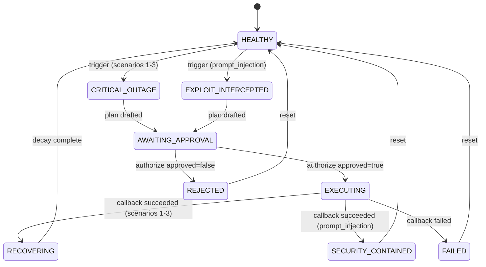

# API reference

> **What to notice:** this is a stateful control-plane API rather than a collection of independent
> CRUD endpoints. Idempotency protects repeated decisions, authentication protects worker claims,
> and a single Server-Sent Events (SSE) stream carries the observable state back to the operator.

This chapter covers everything `incident-agent-api` exposes, the frame format of the live stream,
and the state machine the endpoints move through. [The architecture chapter](./architecture.md)
covers what sits behind these routes.

## Base URL

Direct: `http://localhost:8000`.

Through the War Room: the same origin as the browser page, because
`services/incident-war-room/nginx.conf` proxies `/api/` to the API container and `/s3/` to
LocalStack. That is why the frontend needs no CORS configuration and no absolute API URL in a
normal Compose deployment.

The application is built with FastAPI's defaults for documentation — see `create_app()` in
`services/incident-agent-api/src/incident_agent_api/main.py:146`, which sets only `title`,
`version`, and `lifespan` — so the interactive schema is served at `/docs` and the raw
specification at `/openapi.json`.

## Every endpoint

| Method | Path | Purpose | Advances state |
|---|---|---|---|
| `GET` | `/` | Service identity | No |
| `GET` | `/healthz` | Liveness plus dependency detail | No |
| `GET` | `/metrics` | Prometheus exposition | No |
| `GET` | `/api/telemetry/current` | One telemetry snapshot; the polling fallback | No |
| `GET` | `/api/stream` | The multiplexed SSE channel | No |
| `POST` | `/api/incidents/trigger` | Start a scenario (`202`) | Yes |
| `POST` | `/api/incidents/authorize` | The human decision | Yes |
| `POST` | `/api/incidents/{incident_id}/callback` | Worker completion report | Yes |
| `POST` | `/api/incidents/reset` | Return the platform to baseline | Yes |
| `POST` | `/api/retrieval/search` | Free-text runbook probe | **No** |

`POST /api/retrieval/search` is a read-only probe behind the War Room's query box. It runs the
same hybrid retrieval the pipeline uses, and it never touches the state machine — a visitor can
explore the knowledge base without starting an incident.

Route modules live in `services/incident-agent-api/src/incident_agent_api/api/routes/`.

## `POST /api/incidents/trigger`

Starts a run. Returns `202 Accepted`.

Request:

```json
{ "scenario_id": "db_pool_exhaustion" }
```

`scenario_id` is one of `db_pool_exhaustion`, `cache_thundering_herd`, `worker_deadlock`,
`prompt_injection`.

Response:

```json
{
  "incident_id": "...",
  "thread_id": "...",
  "scenario_id": "db_pool_exhaustion",
  "state": "CRITICAL_OUTAGE"
}
```

Both identifiers take part in later calls. `incident_id` identifies the run for `/reset` and the
stream; `thread_id` identifies the agent thread that `/authorize` resumes.

Defined at `services/incident-agent-api/src/incident_agent_api/api/routes/incidents.py:78`.

## `POST /api/incidents/authorize`

The one human decision in the pipeline.

Request:

```json
{
  "incident_id": "...",
  "thread_id": "...",
  "scenario_id": "db_pool_exhaustion",
  "approved": true
}
```

`approved: true` dispatches the plan to the queue and moves the run to `EXECUTING`.
`approved: false` lands it in `REJECTED`, and nothing runs.

Response:

```json
{
  "incident_id": "...",
  "state": "EXECUTING",
  "job_id": "job-21059",
  "duplicate": false
}
```

`job_id` is `null` on rejection. `duplicate` is `true` when this decision had already been
recorded, so a double-click is answered rather than double-dispatched.

Defined at `incidents.py:228`.

## `POST /api/incidents/{incident_id}/callback`

The worker's completion report, and **the only authenticated endpoint on the service**.

`/trigger`, `/authorize`, and `/reset` are deliberately open: this is a public demo and a visitor
has to be able to drive it. The callback is different because it is the one endpoint that advances
state on the strength of a claim about work that already happened somewhere else. A caller who
could forge it would move a run to `RECOVERING` with no remediation having occurred.

```
Authorization: Bearer $CALLBACK_SECRET
```

Request body — `WorkerCallback` in `packages/contracts/src/tripleten_contracts/jobs.py:73`:

| Field | Notes |
|---|---|
| `status` | `succeeded` or `failed` |
| `job_id` | The dispatched job |
| `idempotency_key` | Deduplicates at-least-once redelivery |
| `postmortem_uri` | `s3://` URI, present on success |
| `error` | Failure reason, present on failure |
| `logs` | Execution-terminal lines |

`status: succeeded` starts the recovery decay for the three outage scenarios, and lands
`prompt_injection` in `SECURITY_CONTAINED`. `status: failed` lands the run in `FAILED`.

Two properties define the endpoint's safety behavior:

- **Authentication is necessary and not sufficient.** A valid token on a run still sitting at
  `AWAITING_APPROVAL` is refused. The callback cannot be used to bypass the approval gate.
- **The idempotency check runs before the state guard, deliberately.** SQS delivers at least
  once, so a duplicate is normal traffic rather than an error: a redelivery arriving after the
  first one succeeded gets `200` with `duplicate: true`, not a `409`.

Defined at `incidents.py:300`.

## `POST /api/incidents/reset`

Clears the run and returns the platform to baseline. This is how a terminal state is left —
`REJECTED`, `FAILED`, and `SECURITY_CONTAINED` all hold their values until it is called.

Request `{ "incident_id": "..." }`; the response carries `incident_id: null` and
`state: "HEALTHY"`. Defined at `incidents.py:146`.

## `GET /api/stream`

The multiplexed Server-Sent Events channel, one frame per 1000 ms.

```
GET /api/stream                        # follow the platform, including baseline
GET /api/stream?incident_id=...        # follow one run
```

`incident_id` is optional, and omitting it is the normal case for a freshly loaded War Room: the
dashboard renders live baseline charts before anyone picks a scenario, so the stream exists before
a run does. Supplying it is a claim of ownership enforced at both ends — a mismatch at connect
time is refused with `409`, and a stream that outlives its run is closed rather than allowed to
drift onto the next one. A tab left open across a reset would otherwise render the next
incident's telemetry under the previous run's identity.

Every frame rides the default SSE `message` event. The `type` field is what the browser
demultiplexes on, and there are exactly five channels — adding a sixth is a contract change:

| `type` | Payload carries |
|---|---|
| `METRICS_UPDATE` | The full telemetry snapshot |
| `LOG_STREAM` | One log line plus whether it was sanitized |
| `RAG_MATCH` | Runbook id, title, cosine similarity, RRF rank, excerpt, source |
| `AGENT_THOUGHT` | Step number, phase, narration, the proposed tool call, guardrail verdict |
| `WORKER_LOG` | Source, level, message |

Every frame shares three envelope fields: `event_id` (a process-monotonic `evt-<n>`),
`incident_id` (`null` at baseline), and `timestamp`.

An example `AGENT_THOUGHT` frame:

```json
{
  "type": "AGENT_THOUGHT",
  "event_id": "evt-42",
  "incident_id": "...",
  "timestamp": "2026-08-21T12:06:24.881000+00:00",
  "data": {
    "step": 5,
    "phase": "TOOL_SELECTION",
    "text": "Selected flush_connection_pool from RB-104; guardrail validated its arguments.",
    "tool_call": { "name": "flush_connection_pool", "args": { "target": "postgres", "max_idle_seconds": 60 } },
    "guardrail": "PASSED"
  }
}
```

`phase` is one of `ANALYZING`, `RETRIEVING`, `PLANNING`, `TOOL_SELECTION`, `AWAITING_APPROVAL`.
`guardrail` is `PASSED` or `BLOCKED`. The envelope and payload models are in
`packages/contracts/src/tripleten_contracts/events.py`.

**There is no event replay.** A client that reconnects gets frames from that moment on, not the
run's history. A mid-run page reload therefore shows current state without the earlier reasoning.
`GET /api/telemetry/current` is the polling fallback for the metrics half.

## The state machine



The nine states are defined in `packages/contracts/src/tripleten_contracts/states.py`.

**The main path** is `HEALTHY → CRITICAL_OUTAGE → AWAITING_APPROVAL → EXECUTING → RECOVERING →
HEALTHY`.

**`prompt_injection` takes a different path** and never enters `CRITICAL_OUTAGE`:
`HEALTHY → EXPLOIT_INTERCEPTED → AWAITING_APPROVAL → EXECUTING → SECURITY_CONTAINED`.
`EXPLOIT_INTERCEPTED` is a phase the run passes through, not a resting place.

**Three terminal states**, each holding its metric values until `/reset`:

| State | Reached from | By |
|---|---|---|
| `REJECTED` | `AWAITING_APPROVAL` | `authorize` with `approved: false` |
| `FAILED` | `EXECUTING` | An authenticated callback reporting `status: failed` after the retry budget is spent |
| `SECURITY_CONTAINED` | `EXECUTING` | `prompt_injection` containment completing successfully |

## The approval gate

`AWAITING_APPROVAL` is a hard stop. No remediation runs before an explicit
`POST /api/incidents/authorize`: there is no timeout that approves, no auto-advance, and no path
that skips it — including the authenticated callback, which is refused on a run still waiting.

The reason it holds is structural rather than procedural: the API process has no state-changing
tool in its dispatch table, and an import-time assertion stops the service from starting if one
is ever added. See [the simulation boundary](./architecture.md#the-simulation-boundary).
